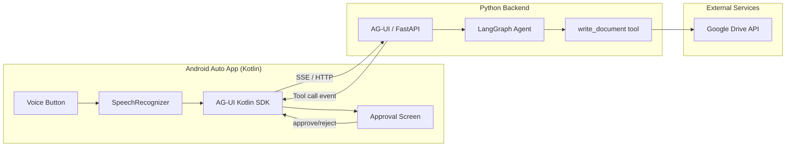

# Build Cait - AI Car Assistant

## Progress

| # | Task | Status |
|---|------|--------|
| 1 | Environment setup (JDK, Android SDK, DHU, AVD, Python) | **Partial** -- JDK 17 installed, SDK cmdline-tools + platform-tools + build-tools + emulator + DHU installed at `C:\Android\SDK`. System image download pending (manual). `ANDROID_HOME` and `JAVA_HOME` set as user env vars. Setup script not yet written. |
| 2 | Scaffold Android project (Gradle, manifest, CarAppService, Session, Screen) | Pending |
| 3 | Implement ApprovalScreen for human-in-the-loop tool approval | Pending |
| 4 | Integrate AG-UI Kotlin SDK (streaming events, tool calls) | Pending |
| 5 | Scaffold Python backend (Poetry, FastAPI, AG-UI LangGraph endpoint) | Pending |
| 6 | Implement LangGraph agent with `write_document` tool + `interrupt_before` | Pending |
| 7 | Implement Google Drive `write_document` tool (Drive API v3) | Pending |
| 8 | README.md | **Done** -- pushed to repo |
| 9 | Cursor rule (`.cursor/rules/cait-context.mdc`) | **Done** -- pushed to repo |

## Environment State

- **JDK**: Microsoft OpenJDK 17.0.18 at `C:\Program Files\Microsoft\jdk-17.0.18.8-hotspot`
- **Android SDK**: `C:\Android\SDK` with cmdline-tools, platform-tools, build-tools;35.0.0, emulator, platforms;android-35, extras;google;auto (DHU)
- **System image**: `system-images;android-35;google_apis;x86_64` download incomplete -- finish manually with `sdkmanager "system-images;android-35;google_apis;x86_64"`
- **AVD**: Not yet created -- after system image: `avdmanager create avd -n "CaitTestDevice" -k "system-images;android-35;google_apis;x86_64"`
- **Env vars** (set as User variables): `ANDROID_HOME=C:\Android\SDK`, `JAVA_HOME=C:\Program Files\Microsoft\jdk-17.0.18.8-hotspot`, PATH includes cmdline-tools/latest/bin, platform-tools, emulator, JDK bin
- **Python**: 3.13.12 available
- **Poetry**: 2.2.1 available
- **GitHub repo**: https://github.com/Luttik/cait (public)

## Architecture



## Project Structure

```
cait/
├── android/                          # Android Auto app (Kotlin + Gradle)
│   ├── app/
│   │   ├── src/main/
│   │   │   ├── kotlin/com/cait/auto/
│   │   │   │   ├── CaitCarAppService.kt   # CarAppService entry point
│   │   │   │   ├── CaitSession.kt         # Session lifecycle
│   │   │   │   ├── CaitScreen.kt          # Main UI: voice button + status
│   │   │   │   ├── ApprovalScreen.kt      # Tool approval UI
│   │   │   │   └── AgUiClient.kt          # AG-UI SDK wrapper
│   │   │   ├── res/xml/automotive_app_desc.xml
│   │   │   └── AndroidManifest.xml
│   │   └── build.gradle.kts
│   ├── build.gradle.kts
│   ├── settings.gradle.kts
│   └── gradle/
├── backend/                          # Python backend
│   ├── pyproject.toml                # Poetry deps
│   ├── cait_backend/
│   │   ├── __init__.py
│   │   ├── server.py                 # FastAPI + AG-UI endpoint
│   │   ├── agent.py                  # LangGraph agent definition
│   │   └── tools/
│   │       ├── __init__.py
│   │       └── google_drive.py       # write_document tool
│   └── tests/
│       └── test_agent.py
├── README.md
├── AGENTS.md
├── plan.md                           # <-- you are here
└── .cursor/rules/cait-context.mdc
```

## Detailed Task Specs

### Task 1: Environment Setup

**Done so far:**
- JDK 17 installed via `winget install Microsoft.OpenJDK.17`
- Android SDK at `C:\Android\SDK` with all packages except system image
- User env vars set: `ANDROID_HOME`, `JAVA_HOME`, `PATH` additions

**Remaining:**
- Finish system image: `sdkmanager "system-images;android-35;google_apis;x86_64"`
- Create AVD: `avdmanager create avd -n "CaitTestDevice" -k "system-images;android-35;google_apis;x86_64"`
- Write `scripts/setup-env.ps1` automation script

### Task 2: Android Project Scaffold

- Gradle multi-module project at `android/`
- Root `build.gradle.kts` with Android Gradle Plugin + Kotlin plugin
- `settings.gradle.kts` including `:app` module
- App `build.gradle.kts`: minSdk 29, targetSdk 35, Car App Library 1.7.0, AG-UI Kotlin SDK
- `AndroidManifest.xml` with CarAppService, permissions (RECORD_AUDIO, INTERNET)
- `automotive_app_desc.xml` with `<uses name="template" />`
- `CaitCarAppService.kt` extending CarAppService
- `CaitSession.kt` managing session lifecycle
- `CaitScreen.kt` with PaneTemplate: status text row + voice button in action strip using SpeechRecognizer

### Task 3: ApprovalScreen

- `ApprovalScreen.kt` using a `LongMessageTemplate` or `MessageTemplate`
- Shows tool name + parameter preview (title, content summary)
- Two action buttons: Approve / Reject
- On approve: signal AG-UI client to continue
- On reject: signal AG-UI client to cancel, return to main screen

### Task 4: AG-UI Kotlin Client Integration

- `AgUiClient.kt` wrapping `com.contextable:agui4k-agent-sdk:0.2.1`
- Connect to backend URL (configurable)
- `sendMessage(text)` returns a Kotlin Flow of AG-UI events
- Handle `TOOL_CALL_START` events: extract tool name/args, trigger ApprovalScreen
- Handle `TEXT_MESSAGE_CONTENT` events: update status / response text
- Handle `RUN_FINISHED`: show final response

### Task 5: Python Backend Scaffold

- Poetry project at `backend/` with `pyproject.toml`
- Dependencies: langchain, langgraph, langchain-openai, ag-ui-langgraph, fastapi, uvicorn, google-api-python-client, google-auth-oauthlib
- `server.py`: FastAPI app with AG-UI endpoint at `POST /api/agent` via `add_langgraph_fastapi_endpoint()`
- `.env` file pattern for API keys (OPENAI_API_KEY, GOOGLE_DRIVE_FOLDER_ID)
- `backend/.gitignore` for credentials/token files

### Task 6: LangGraph Agent

- `agent.py`: StateGraph with MessagesState
- Nodes: `agent` (LLM call), `tools` (tool execution)
- Single tool: `write_document(title: str, content: str) -> str`
- `interrupt_before=["tools"]` for human-in-the-loop approval
- System prompt: "You are Cait, an AI car assistant. When asked to write something, use the write_document tool."

### Task 7: Google Drive Tool

- `tools/google_drive.py`: `write_document(title: str, content: str) -> str`
- Uses Google Drive API v3 to upload a `.md` file
- Target folder from env var `GOOGLE_DRIVE_FOLDER_ID`
- OAuth2 flow with `credentials.json` / `token.json`
- Returns the web view link of the created file
